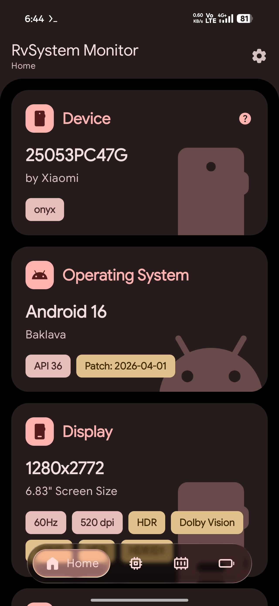
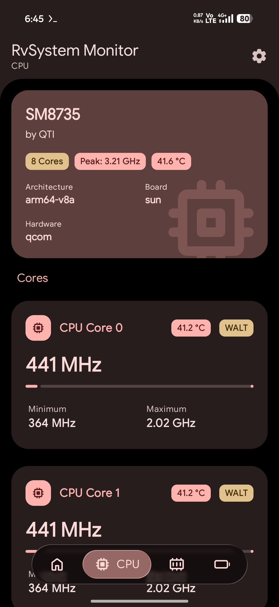
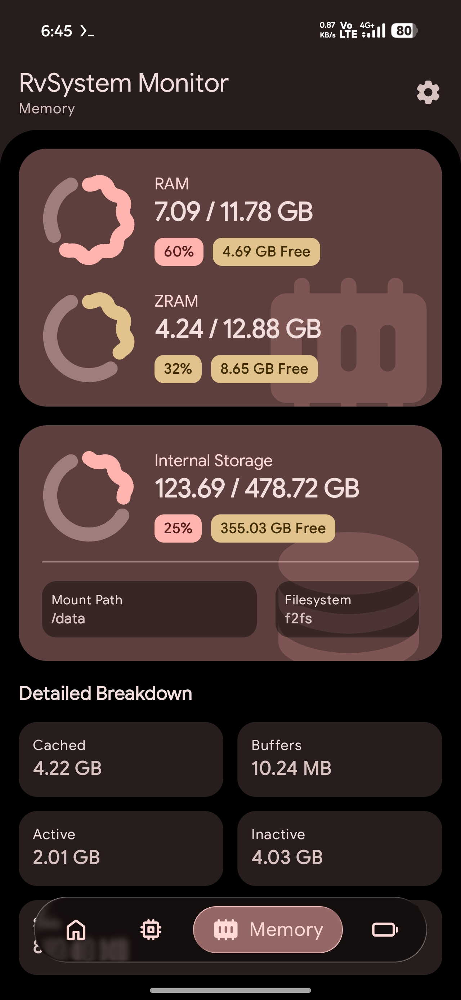
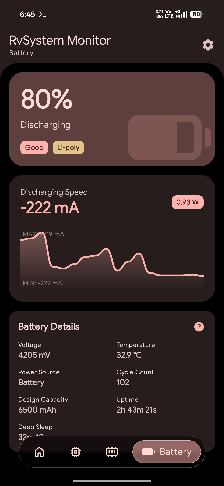
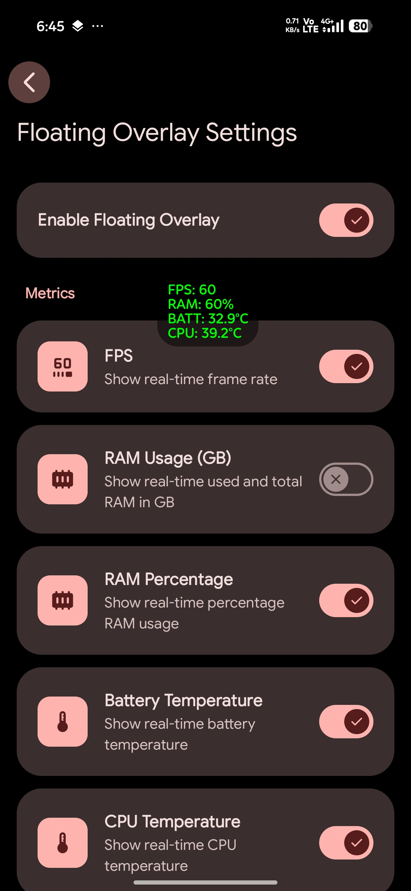
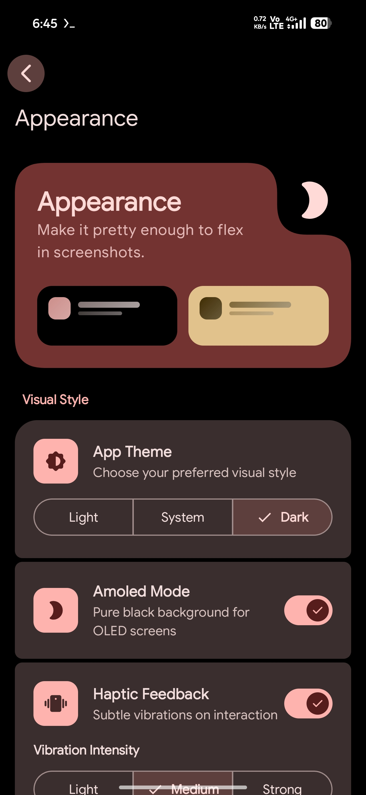

# 🚀 RvSystem Monitor

[](https://developer.android.com)
[](https://kotlinlang.org)
[](https://www.rust-lang.org)
[](https://github.com/Rve27/RvSystem-Monitor/releases)
[](LICENSE)
[](https://developer.android.com/compose)
[](https://github.com/Rve27/RvSystem-Monitor/releases)

**RvSystem Monitor** is a high-performance system monitoring solution for Android, merging the expressive power of **Jetpack Compose** with the raw efficiency of **Rust**. It provides low-level hardware insights while maintaining a modern, buttery-smooth user experience.

---

## 📖 Table of Contents
- [🚀 Overview](#-overview)
- [📸 Screenshots](#-screenshots)
- [✨ Key Features](#-key-features)
- [🛠️ Tech Stack](#-tech-stack)
- [📂 Project Structure](#-project-structure)
- [🏗️ Architecture](#-architecture)
- [⚙️ Getting Started](#-getting-started)
- [🤝 Contributing](#-contributing)
- [💬 Support](#-support)
- [📜 License](#-license)

---

## 🚀 Overview
RvSystem Monitor bridges the gap between high-level UI frameworks and low-level system APIs. By utilizing a Rust-based backend, it minimizes the performance overhead typically associated with frequent polling of kernel files like `/proc` and `/sys`. This hybrid approach allows for real-time monitoring of CPU frequencies, GPU drivers, battery health, and memory usage without compromising the device's responsiveness.

Built with **Material 3 Expressive**, the application offers a visually rich experience with adaptive layouts and sophisticated transitions, making system diagnostics both powerful and beautiful.

---

## 📸 Screenshots

<p align="center">
  
  
  
</p>
<p align="center">
  
  
  
</p>

---

## ✨ Key Features

- **🔋 Battery Intelligence**: Live tracking of Wattage (W), cycle counts (Android 14+), health percentage, and precise Deep Sleep vs. Uptime metrics.
- **🖥️ Floating Overlay**: A draggable, high-performance floating monitor powered by Android's `Choreographer` for accurate frame-timing.
  - **Metrics**: Real-time FPS tracking, RAM usage (GB/Percentage), and live CPU & Battery temperatures.
  - **Customization**: Fully configurable via dedicated settings including update intervals (down to 0.5s), text size, colors, background opacity, padding, and corner radius.
  - **Adaptive Layout**: Supports both horizontal (piped) and vertical (stacked) orientations to fit any screen usage scenario.
- **🎮 GPU & Graphics**: Retrieval of GPU renderer, vendor, and supported OpenGL ES & Vulkan versions directly through the EGL context and native drivers.
- **⚙️ CPU Dynamics**: Detailed per-core monitoring including current, minimum, and maximum frequencies and scaling governors.
- **🧠 Memory & ZRAM**: High-precision tracking of RAM and ZRAM usage, including cached, buffers, and kernel slab memory.
- **💾 Backup & Restore**: Easily export and import your app settings and overlay configurations to keep your setup safe.
- **⚡ Native Performance**: Optimized Rust backend that parses kernel files and interacts with hardware drivers directly with efficient JNI batching.
- **🎨 Expressive UI**: Built with Material 3 Expressive, featuring adaptive layouts, sophisticated screen transitions (MD3 Expressive), and optimized recomposition.

---

## 🛠️ Tech Stack

- **Languages**: Kotlin 2.4.0, Rust (Edition 2024), C (via `libc`).
- **Frameworks**: Jetpack Compose (BOM 2026.06.00), Material 3 Expressive, Hilt DI.
- **Native Bridge**: JNI via `jni-rs`, `cargo-ndk`.
- **Infrastructure**: Gradle Kotlin DSL, Android NDK 30.0, Fastlane.
- **Distribution**: Multiple flavors (GitHub, F-Droid) with toggleable update mechanisms.
- **Libraries**: Retrofit 3.0, OkHttp 5.4, Coil 3.5, Jetpack DataStore.

---

## 📂 Project Structure
```text
RvSystem-Monitor/
├── app/                  # Android application module (Kotlin)
│   ├── src/main/java/    # UI, ViewModels, and JNI bridge declarations
│   ├── src/main/jniLibs/ # Compiled native shared libraries (.so)
│   ├── src/main/res/     # App resources and icons
│   └── build.gradle.kts  # Gradle configuration for Android
├── rust/                 # Native monitoring backend (Rust)
│   ├── src/              # Kernel parsing, JNI implementation, and drivers
│   ├── Cargo.toml        # Rust package and dependency metadata
│   └── README.md         # Documentation for the Rust sub-system
├── gradle/               # Build system scripts and version catalogs
├── fastlane/             # Automation for screenshots and deployments
├── LICENSE               # GNU GPL v3.0
└── README.md             # This file
```

---

## 🏗️ Architecture

The project adheres to **Clean Architecture** principles, ensuring a strict separation of concerns and high maintainability.

### The Hybrid Core
- **UI Orchestration**: The Kotlin layer manages the application lifecycle and UI state. It uses ViewModels to expose reactive data streams from Hilt-injected repositories.
- **Native Data Source**: The Rust layer handles the "heavy lifting". It parses system files and interacts with hardware drivers. By mirroring the Linux kernel's structure (`kernel/` for CPU, `mm/` for Memory, and `drivers/` for GPU), it provides an idiomatic and high-performance data source.
- **Optimized JNI Bridge**: Instead of frequent fine-grained calls, the bridge is designed for **batch data retrieval**. Single calls fetch complete data sets (e.g., all CPU metrics at once), significantly reducing context-switching overhead between the JVM and Native code.

---

## ⚙️ Getting Started

### Prerequisites
- **Android Studio** (Ladybug 2024.2.1 or newer)
- **Rust Toolchain** ([rustup.rs](https://rustup.rs/)): Edition 2024 (Stable 1.85+ recommended).
  - Add Android targets: `rustup target add aarch64-linux-android armv7-linux-androideabi`
- **Android NDK** (Version `30.0.14904198` configured)
- **cargo-ndk**: `cargo install cargo-ndk`

### Installation & Build
1. **Clone the repository**:
   ```bash
   git clone https://github.com/Rve27/RvSystem-Monitor.git
   cd RvSystem-Monitor
   ```
2. **Build Native Libraries**:
   ```bash
   ./gradlew :app:buildRustLibraries
   ```
3. **Build the application**:
   Choose the variant you want to build:
   - **GitHub Variant** (Includes auto-updater):
     ```bash
     ./gradlew assembleGithubRelease
     ```
   - **F-Droid Variant** (No updater):
     ```bash
     ./gradlew assembleFdroidRelease
     ```
4. **Install and run (Debug)**:
   Connect an Android device (API 34+) and run:
   ```bash
   ./gradlew installGithubDebug
   ```

---

## 🤝 Contributing
We welcome contributions from the community! Whether you are fixing a bug, adding a feature, or improving documentation, please read our [CONTRIBUTING.md](CONTRIBUTING.md) to get started.

## 💬 Support
- **Issues**: [GitHub Issues](https://github.com/Rve27/RvSystem-Monitor/issues) for bug reports and feature requests.
- **Discussions**: [GitHub Discussions](https://github.com/Rve27/RvSystem-Monitor/discussions) for questions and ideas.

## 📜 License
This project is licensed under the **GNU General Public License v3.0**. See the [LICENSE](LICENSE) file for details.

---
<p align="center">
  Built with ❤️ for the Android Community.
</p>
